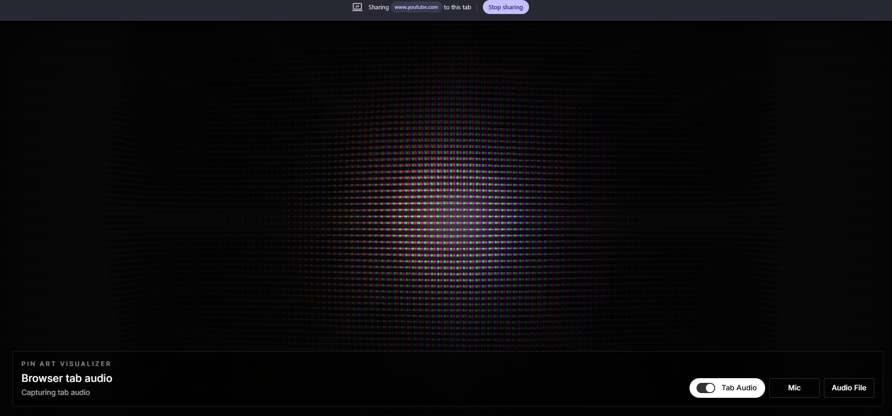

# 3D Pin Art Visualizer

A real-time audio visualizer rendered as a colorful reactive 3D pin art lattice, 
built with React and Three.js.



## Features

- 🎵 **Tab Audio** — capture audio from any browser tab
- 🎤 **Microphone** — react to live mic input
- 📁 **Audio File** — upload and visualize any MP3

## Run Locally

Prerequisite: Node.js 22 or newer.

```bash
npm install
npm run dev
```

Open http://localhost:3000 in Chrome.

## Built With

- React
- Three.js
- Web Audio API

## Quality Checks

```bash
npm run typecheck
npm run build
```